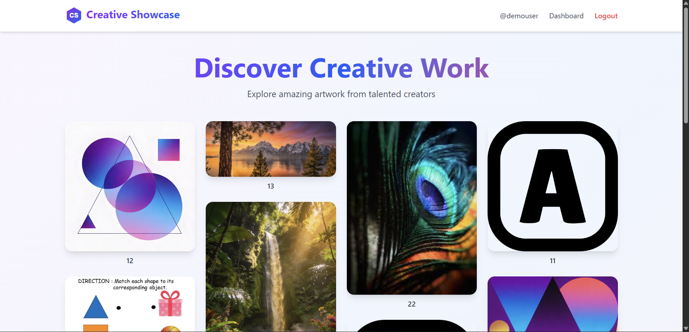
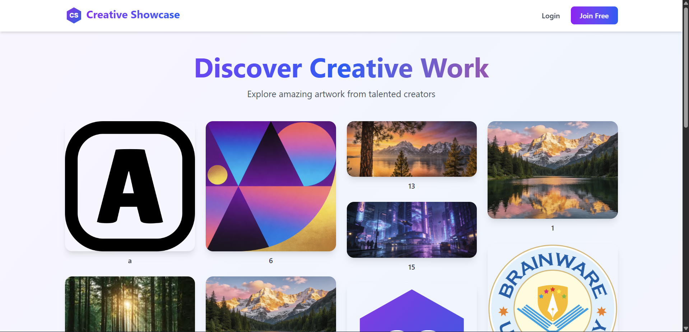
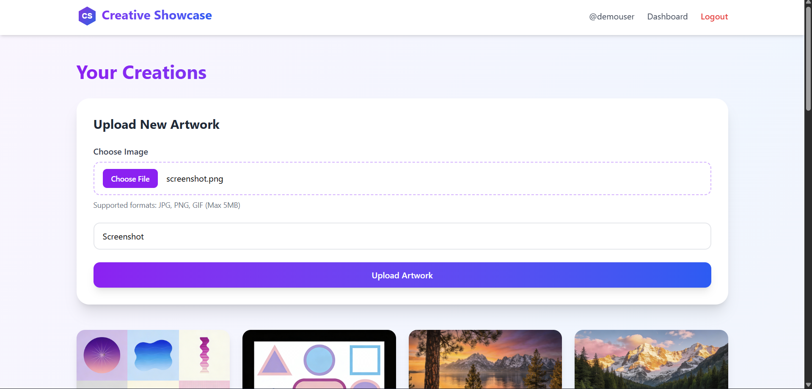
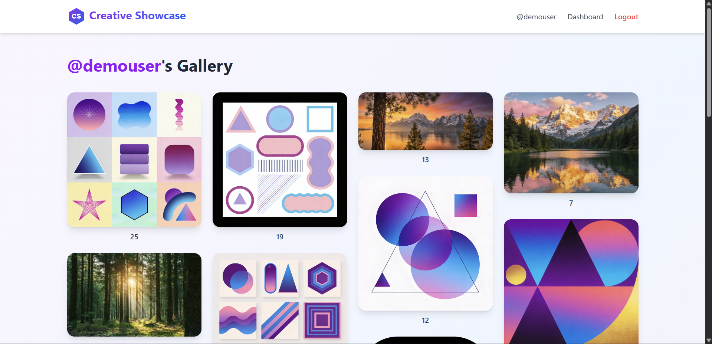

#  Creative Showcase

A full-stack web application that allows artists and creators to upload, store, and showcase their digital artwork or memories in a clean, gallery-style interface.

The platform supports authentication, private dashboards, public profiles, and cloud-based image storage.

---

## 🚀 Live Demo

[Creative Showcase Live](https://creative-showcase-amarnath-kumar.vercel.app/)

Demo Credentials:

```
Email: demouser@gmail.com
Password: Demo@12345
```

---

## Features

### Authentication

- User signup and login
- Secure JWT authentication using HTTP-only cookies
- Protected routes for authenticated users

### Image Upload & Storage

- Upload images directly from the dashboard
- Images stored securely on **Cloudinary**
- Metadata stored in **MongoDB**
- Delete uploaded images

### User Profiles

- Private dashboard for managing uploads
- Public profile page: `/profile/:username`
- Shareable user galleries

### Landing Page

- Randomly displays images from all users
- Masonry (Pinterest-style) layout
- Responsive design for all screen sizes

### Performance & Security

- Rate limiting on authentication and image uploads
- Skeleton loaders for better UX
- Lazy loading images
- Secure API design

---

## Screenshots









---

## Tech Stack

### Frontend

- React (Vite)
- Tailwind CSS (v4)
- Zustand (state management)
- Zod (form validation)
- Axios
- React Router
- React Hot Toast

### Backend

- Node.js
- Express.js
- MongoDB + Mongoose
- Cloudinary (image storage)
- JWT (authentication)
- Express Rate Limit
- Cookie Parser

---

## 📂 Project Structure

```
Creative-Showcase/
│
├── backend/
│   ├── config/
│   │   ├── db.js
│   │   └── cloudinary.js
│   ├── controllers/
│   ├── middlewares/
│   ├── models/
│   ├── routes/
│   ├── .env
│   └── index.js
│
├── frontend/
│   ├── src/
│   │   ├── api/
│   │   ├── components/
│   │   ├── pages/
│   │   ├── routes/
│   │   ├── store/
│   │   ├── schemas/
│   │   ├── App.jsx
│   │   ├── index.css
│   │   └── main.jsx
│   ├── public/
│   └── vite.config.js
│
└── README.md
```

---

## Environment Variables

Create a `.env` file inside the **backend** folder:

```env
PORT=5000

MONGO_URI=mongodb://127.0.0.1:27017/creative_showcase

JWT_SECRET=your_jwt_secret

CLOUDINARY_CLOUD_NAME=your_cloud_name
CLOUDINARY_API_KEY=your_api_key
CLOUDINARY_API_SECRET=your_api_secret
```

---

## How to Run Locally

### Clone the Repository

```bash
git clone https://github.com/Amarsah15/Intern-Technical-Assessment.git
cd Creative-Showcase
```

### Backend Setup

```bash
cd backend
npm install
npm run dev
```

Backend runs at:

```
http://localhost:5000
```

### Frontend Setup

```bash
cd frontend
npm install
npm run dev
```

Frontend runs at:

```
http://localhost:5173
```

---

## API Overview

### Auth Routes

```
POST   /api/v1/auth/signup
POST   /api/v1/auth/login
POST   /api/v1/auth/logout
GET    /api/v1/auth/me
```

### Image Routes

```
POST   /api/v1/images/upload
GET    /api/v1/images/myimages
GET    /api/v1/images/user/:username
GET    /api/v1/images/random
DELETE /api/v1/images/:id
```

---

## Key Design Decisions

- Cloudinary over local storage for scalability
- JWT in cookies for secure authentication
- Zustand instead of Context API for cleaner state management
- MongoDB aggregation for random image sampling
- Rate limiting to prevent abuse

---

## Future Enhancements

- Likes and comments on images
- User follow system
- User search functionality
- Image categories/tags
- Dark mode
- Infinite scroll on landing page
- OTP-based signup, password reset

---

## 👨‍💻 Author

**Amarnath Kumar**
